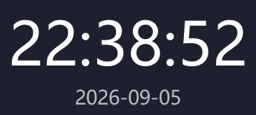

# DesktopClock 桌面时钟

一款轻量的桌面时钟：像壁纸一样常驻桌面、被打开的窗口自动遮挡，也可以置顶或作为普通窗口使用。字体、字号、颜色、透明度全部可自定义，带系统托盘，Windows / macOS / Linux 通吃。



## 功能特性

- **三种显示方式**（右键或托盘菜单随时切换，默认「固定在桌面」）：

  | 显示方式 | 行为 | 任务栏 |
  |---|---|---|
  | 固定在桌面 | 像壁纸一样贴在桌面，打开任何软件都会盖住它；锁定拖动防误碰，仍可右键操作 | 不显示 |
  | 浮在其他窗口上方 | 始终置顶，不会被任何窗口遮挡 | 显示 |
  | 普通窗口 | 普通软件行为，可被其他窗口盖住 | 显示 |

- **锁定位置**：任何显示方式下都可勾选，防止误拖动
- **字体自定义**：系统字体下拉选择，或从 ttf / otf / ttc 字体文件加载；设置面板内**实时预览**显示效果
- **字号 8–200、任意颜色、不透明度 10%–100%**
- **显示日期、显示秒、12/24 小时制**均可开关
- **系统托盘常驻**：左键单击隐藏/唤回时钟，右键菜单可完成全部操作
- **设置与窗口位置自动记住**（存于 `~/.desktop-clock/settings.json`）
- 每秒整点对齐刷新，几乎不占 CPU；打包后单文件约 36 MB

## 使用方法

### 启动

双击 `dist/DesktopClock.exe`（打包版），或：

```bash
python main.py
```

首次运行时钟出现在桌面中央，拖到你喜欢的位置即可（位置会记住）。

### 日常操作

| 操作 | 方式 |
|---|---|
| 移动位置 | 按住时钟直接拖（桌面模式或勾选「锁定位置」时禁用） |
| 打开设置 | 时钟上右键 → **设置…** |
| 切换显示方式 | 右键 → **显示方式** 子菜单，或托盘右键菜单 |
| 锁定/解锁位置 | 右键 → **锁定位置** |
| 临时隐藏/唤回 | 左键单击托盘图标，或菜单 → **隐藏时钟** |
| 退出 | 右键/托盘菜单 → **退出** |

### 设置面板

- **显示方式**：三选一（同上表）
- **锁定位置**：等价于右键菜单里的勾选项
- **字体**：系统字体下拉；「从字体文件加载…」支持 ttf / otf / ttc
- **字号**：8–200
- **颜色**：任意颜色；预览区即时显示效果
- **显示日期 / 显示秒 / 24 小时制**：即时生效
- **不透明度**：10%–100%

点「确定」立即生效并保存。设置文件在 `~/.desktop-clock/settings.json`，删掉它即可恢复全部默认值。

### 开机自启（可选）

- **Windows**：`Win+R` 输入 `shell:startup`，把 `DesktopClock.exe` 的快捷方式放进去
- **macOS**：系统设置 → 通用 → 登录项
- **Linux**：桌面环境的「自启动」设置中添加

## 运行环境

| 项目 | 要求 |
|---|---|
| 操作系统 | Windows 10/11、macOS 12+、Linux（X11 桌面；Wayland 下「固定在桌面」受系统限制，自动降级为普通窗口行为） |
| Python | 3.10 – 3.13 |
| 运行时依赖 | 仅 `PySide6-Essentials`（Qt 官方 Python 绑定核心包） |
| 磁盘 | 源码 < 1 MB；虚拟环境约 400 MB；打包单文件 exe 约 36 MB |
| 内存 | 运行时约 60 MB |

> **Windows 已知坑**：把 PySide6 装进系统 Python 的用户目录会因「长路径支持未开启」而安装失败（Qt 内部有超过 260 字符的路径）。解决方式就是本项目默认的做法——使用项目内虚拟环境（路径短），无需修改系统设置。

## 从源码运行

```bash
# 1. 创建虚拟环境
python -m venv .venv

# 2. 安装依赖（Windows 用 .venv\Scripts\python.exe，macOS/Linux 用 .venv/bin/python）
.venv\Scripts\python.exe -m pip install PySide6-Essentials

# 3. 运行
.venv\Scripts\python.exe main.py
```

## 打包发行

```bash
# Windows（实测产出 dist/DesktopClock.exe，带应用图标）
.venv\Scripts\pyinstaller.exe --onefile --windowed --name DesktopClock --icon assets/icon.ico --add-data "assets;assets" main.py

# macOS / Linux
.venv/bin/pyinstaller --onefile --windowed --name DesktopClock --icon assets/icon.ico --add-data "assets:assets" main.py
```

或直接使用脚本：`build.ps1`（Windows）、`build.sh`（macOS/Linux）。

### Release 自动发布

仓库已配置 GitHub Actions（[.github/workflows/release.yml](.github/workflows/release.yml)），照搬 blog-starter 的发布模式：

- **打 tag 自动发布**：`git tag v1.0.0 && git push origin v1.0.0` → 自动在三个平台跑测试、构建、自检，并把安装包挂到 Releases 页
- **手动验证构建**：Actions 页选「Desktop Release」→ Run workflow（只出构建产物，不发布）
- 产物：`DesktopClock-windows.exe`、`DesktopClock-macos.zip`（未签名）、`DesktopClock-linux.tar.gz`

构建依赖见 `requirements.txt`（PySide6-Essentials / pyinstaller / pytest）。

图标由 `scripts/gen_icon.py` 程序化生成（16/32/48/256 四尺寸，纯 Python 装配 ICO，无额外依赖），想换样式改脚本里的绘制参数后重跑即可。

## 运行测试

```bash
.venv\Scripts\python.exe -m pytest tests -q    # Windows
.venv/bin/python -m pytest tests -q            # macOS / Linux
```

53 条测试覆盖时间/日期格式化、设置迁移与安全读写、字体加载、三种显示方式窗口标志、拖动锁、设置面板预览等。

## 自检

```bash
python main.py --selftest
```

三种显示方式各渲染一帧并校验图标资源，输出 `SELFTEST_OK_*` 与 `ICON_OK`，退出码 0 即健康。

## 项目结构

```
clock_core.py      时间/日期文本格式化（纯函数）
settings.py        设置读写（JSON、缺省回退、旧配置迁移、防路径穿越）
fonts.py           系统字体枚举、字体文件加载
main.py            主程序（窗口、三显示方式、托盘、设置面板、selftest）
tests/             pytest 测试（53 条）
scripts/gen_icon.py        图标生成（QPainter 绘制 + ICO 装配）
scripts/make_screenshot.py 生成 README 截图
assets/icon.ico    应用图标（多尺寸）
build.ps1 / build.sh       打包脚本
```

## 常见问题

**时钟怎么被游戏/软件挡住了？**
默认就是「固定在桌面」模式——它设计上就像壁纸，任何窗口都会盖在它上面。想让它一直在最上面：右键 → 显示方式 → 浮在其他窗口上方。

**托盘里怎么退出？**
右键托盘图标 → 退出。托盘模式下点窗口关闭键只是隐藏到托盘，不会退出。

**字体列表里没有我想要的字体？**
用「从字体文件加载…」直接选 ttf/otf 文件，无需安装到系统。

**想恢复默认设置？**
删除 `~/.desktop-clock/settings.json` 后重启程序。

## 开源协议

本项目基于 [MIT License](LICENSE) 开源。
